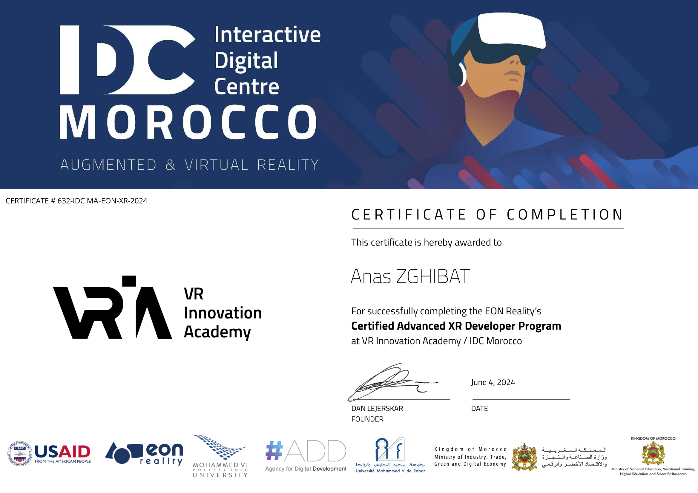
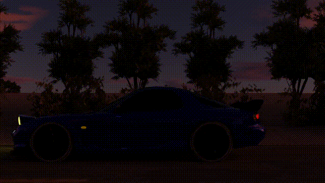
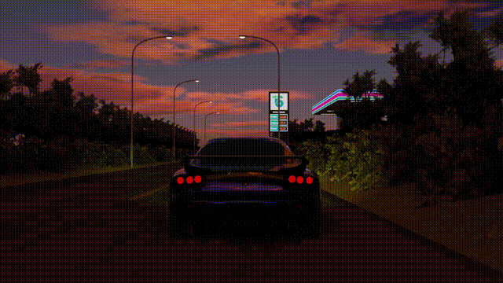
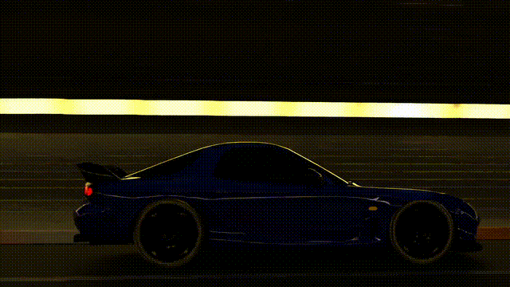
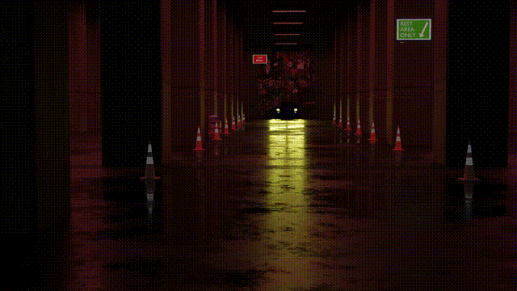

<h1 align="center">Hi, I'm Anass Zghibat 👋</h1>

  💻 Programmer at <strong>42 Network</strong> | 🎮 Certified XR Developer | 🧊 3D Artist & Animator

---

### 🧩 About Me

- 🛠 Currently diving deep into C, algorithms, and system-level programming at **42 School**
- 🎓 Certified in **Advanced XR Development** by EON Reality’s VR Innovation Academy / IDC Morocco
- 🎮 Experienced with **Unity**, 3D modeling, and VR/AR development
- 🧠 Exploring the world of **cybersecurity**, **low-level programming**, and **interactive experiences**
- 🎯 Always building, always learning

---

### 🚧 Current Projects

- 🧱 `libft`, `ft_printf`, `get_next_line`, `push_swap`, `minitalk`, `FDF` – 42 Core Curriculum
- 🎮 Unity VR demos and system prototypes
- 🌐 Working on personal dev tools and a portfolio site

---

### 🧊 3D Modeling & Animation

- 🎨 Skilled in **Blender** for modeling, sculpting, UV unwrapping, texturing, and rigging
- 🌀 Created full 3D character animations and cinematic scenes
- 🎞️ Built VR/AR-ready environments and assets
- 🧠 Mixing creative design with code for immersive tech experiences

> ✨ Bringing code to life — one vertex at a time.

---

### 📜 Certifications

#### 🎓 EON Reality – Advanced XR Developer  
Awarded for successfully completing the **Certified Advanced XR Developer Program**  
at the **VR Innovation Academy / IDC Morocco**

---

### 🎞️ Blender Animation Showcase

#### 🚗 Car Animation: Gas Station Scene  

---

#### 🌳 Car Animation: Sunset Cruise  

---

#### 🌅 Car Animation: Tunnel drive    

---

#### 🛑 Car Animation: Park Drive-Through  

### 🧰 Tech Stack

---

### 📈 GitHub Stats

  
  

---

### 📬 Contact

- 💌 Email: teamatlasdesign@gmail.com  
- 🎯 Always open to collab on cool tech, XR, or open-source projects
